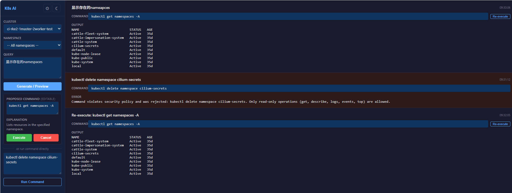

# kpilot-ai

[](LICENSE)
[](https://www.python.org/)
[](https://fastapi.tiangolo.com/)
[](https://developer.chrome.com/docs/extensions/)

**AI-powered Kubernetes copilot with human-in-the-loop control for safe operations.**

kpilot-ai lets you query and inspect Kubernetes clusters using natural language. It generates `kubectl` commands via AI, shows you exactly what will run, and **never executes without your explicit confirmation**. Only read-only operations are allowed — no deletes, no applies, no surprises.

> **[Read the full usage guide →](docs/usage.md)**

---

<!-- Uncomment when screenshots are available -->
<!--
## Screenshots

<p align="center">
  
  &nbsp;
  
</p>
-->

## How It Works

```
┌──────────────┐     ┌──────────────────┐     ┌───────────┐
│   Browser    │────▶│   Backend (API)  │────▶│ kubectl   │
│  Extension   │◀────│   + kubectl-ai   │◀────│ cluster   │
└──────────────┘     └──────────────────┘     └───────────┘
   Thin UI only       AI + validation           Read-only
   No kubectl access   Two-phase model           No writes
```

1. **You ask** — Type a natural language query in the browser extension
2. **AI proposes** — The backend calls kubectl-ai to generate a `kubectl` command
3. **You review** — See the exact command and explanation before anything runs
4. **You confirm** — Only then does the backend execute the command

## Why kpilot-ai?

| | kpilot-ai | Direct kubectl | AI chatbot |
|---|---|---|---|
| Natural language input | Yes | No | Yes |
| Shows command before execution | Always | N/A | Rarely |
| User confirmation required | Always | Manual | Rarely |
| Policy enforcement | Built-in (`rules.yaml`) | RBAC only | None |
| Credential isolation | Per-user | Shared | None |
| Write operations blocked | By design | No | No |

## Features

- **Natural language to kubectl** — "show pods in production", "why is this pod crashing?"
- **Human-in-the-loop** — Every command requires explicit user confirmation
- **Read-only by policy** — Only `get`, `describe`, `logs`, `events`, `top` are allowed
- **Multi-tenant** — Each user configures their own LLM provider and kubeconfig
- **Multiple LLM providers** — OpenAI, Gemini, Ollama, Grok, Bedrock, Azure OpenAI
- **Dark/light theme** — Toggle in the fullscreen view
- **Result history** — Fullscreen view keeps scrollable history of all queries

## Architecture

| Component | Role |
|-----------|------|
| **Browser Extension** | Thin, untrusted UI — no Kubernetes access, no kubeconfig, no kubectl |
| **Backend Service** | FastAPI server — AI command generation, policy validation, kubectl execution |
| **kubectl-ai** | AI command engine — converts natural language to kubectl commands |
| **rules.yaml** | Policy engine — defines allowed/forbidden commands and execution rules |

### Two-Phase Execution Model

```
Preview (no execution)          Confirm & Execute
─────────────────────           ─────────────────
User submits query        ──▶   User clicks "Execute"
AI generates command      ──▶   Backend re-validates policy
Command shown to user     ──▶   Command executed on cluster
```

Auto-execution is **strictly forbidden**.

## Security

- Only read-only kubectl commands: `get`, `describe`, `logs`, `events`, `top`
- Forbidden: `delete`, `apply`, `patch`, `scale`, `rollout`, `exec`, `port-forward`
- Commands are validated against `rules.yaml` at both preview and execution time
- Kubeconfig exists only in the backend — never exposed to browser or AI
- API keys stored in backend memory only — never returned in API responses
- Per-user isolation via `X-User-ID` header


## API Endpoints

| Method | Path | Description |
|--------|------|-------------|
| `GET` | `/api/settings` | Get user configuration |
| `PUT` | `/api/settings` | Save user configuration |
| `DELETE` | `/api/settings` | Clear all user data |
| `GET` | `/api/clusters` | List available clusters |
| `GET` | `/api/namespaces` | List namespaces in a cluster |
| `POST` | `/api/command/preview` | Generate a proposed kubectl command |
| `POST` | `/api/command/execute` | Execute a confirmed command |

> All endpoints require the `X-User-ID` header.

## Deployment

### Docker Compose (recommended for local / dev)

```bash
cp .env.example .env          # edit .env with your API keys
make up                       # or: docker compose up -d
```

### Docker (standalone)

```bash
make build                    # or: docker build -t kpilot-ai-backend ./backend
make run                      # or: docker run --rm -p 8000:8000 --env-file .env kpilot-ai-backend
```

### Offline / Air-Gapped Environments

```bash
make offline-prep             # download binaries + pip packages into backend/offline/
make build-offline            # build fully from local assets (no internet needed)
```

You can also mix modes — e.g. offline pip but online kubectl:

```bash
make build-semi-offline       # pip offline, kubectl + kubectl-ai from internet
```

### Helm (Kubernetes)

```bash
make helm-install             # or: helm install kpilot-ai helm/kpilot-ai --create-namespace
```

Customize via `helm/kpilot-ai/values.yaml` or `--set` flags:

```bash
helm install kpilot-ai helm/kpilot-ai \
  --set llm.provider=gemini \
  --set llm.model=gemini-2.5-pro \
  --set secrets.geminiApiKey=YOUR_KEY \
  --set kubeconfig.enabled=true \
  --set kubeconfig.secretName=my-kubeconfig
```

### Kubernetes (manual manifests)

```bash
kubectl apply -f deploy/namespace.yaml
kubectl apply -f deploy/secret.yaml      # edit with your API keys first
kubectl apply -f deploy/pvc.yaml
kubectl apply -f deploy/deployment.yaml  # edit image reference
kubectl apply -f deploy/service.yaml
kubectl apply -f deploy/ingress.yaml     # optional, edit host
```

### Makefile Quick Reference

| Command | Description |
|---------|-------------|
| `make build` | Build backend Docker image |
| `make build-offline` | Build fully offline (no internet) |
| `make build-semi-offline` | Build with offline pip only |
| `make offline-prep` | Download assets for offline build |
| `make up` | Start services with docker-compose |
| `make down` | Stop docker-compose services |
| `make dev` | Run backend locally without Docker |
| `make helm-install` | Install Helm chart |
| `make helm-uninstall` | Uninstall Helm release |
| `make deploy` | Apply manual k8s manifests |
| `make undeploy` | Delete manual k8s deployment |
| `make help` | Show all available commands |

## Contributing

1. Fork the repository
2. Create a feature branch: `git checkout -b feature/my-feature`
3. Commit your changes: `git commit -m 'Add my feature'`
4. Push to the branch: `git push origin feature/my-feature`
5. Open a Pull Request

Please ensure your changes comply with the architecture constraints in `ARCHITECTURE.md` and `rules.yaml`.

## License

This project is licensed under the MIT License — see the [LICENSE](LICENSE) file for details.
